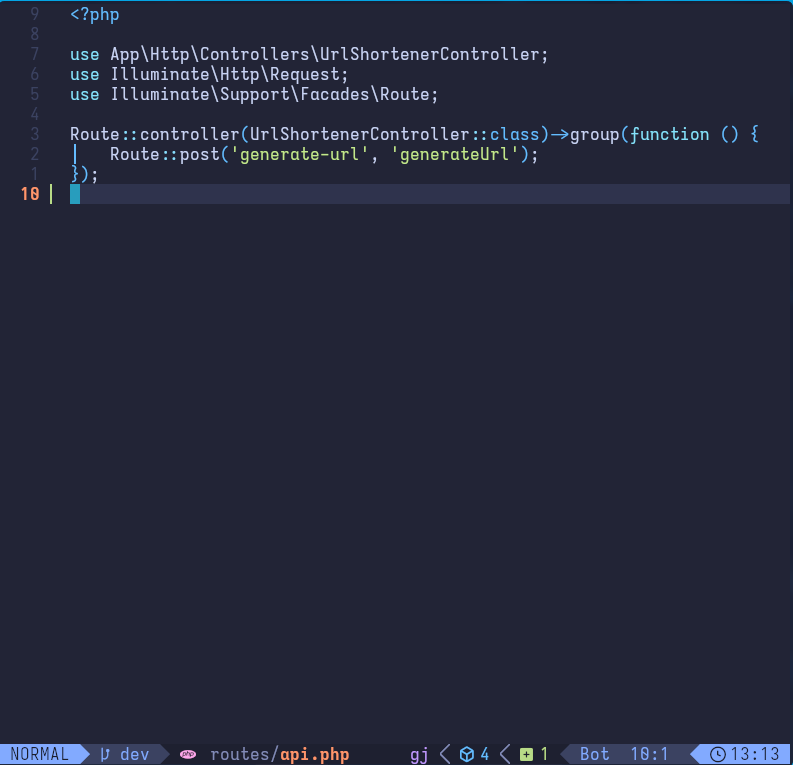

**Innocephca Alpha** is an *open-source*, *sans-serif* + *monospace* typeface family, derived from **Iosevka**, designed for *writing code* and *used in terminals*. It is meant to be lighter and more widely spaced than Iosevka.

I just happen to like Iosevka, but I felt the need to customise it to fit my preferences. I hope people enjoy my fork as well as the original Iosevka. I genuinely think Iosevka deserves more users. My goal is simply to have a more opinionated version of Iosevka.

## Installation

### Installing from the TTF artifacts

1. Download the TTFs directly.
2. Quit all your editors / programs.
3. Unarchive the font package and you will see the font files.
4. Take actions depending on your OS:
    * **Windows**: Select the font files and drag into font [settings](ms-settings:fonts) / font control panel page.  
      * On Windows 10 1809 or newer, the default font installation is per-user, and it may cause compatibility issues for some applications, mostly written in Java. To cope with this, right click and select “Install for all users” instead. [Ref.](https://youtrack.jetbrains.com/issue/JRE-1166?p=IDEA-200145)
    * **macOS**: [Follow instructions here](http://support.apple.com/kb/HT2509).
    * **Linux**: Copy the font files to your fonts directory then run `sudo fc-cache`.

## Features

Innocephca Alpha is what you get when someone picks **one coherent Iosevka configuration and ships it** instead of handing you the build toolkit. Upstream Iosevka exposes a massive matrix of `cv##`/`ss##` stylistic toggles and expects you to compose your own build; this fork takes the opposite stance — one opinionated look, pre-baked, no configuration surface to fuss over.

### What makes it different from stock Iosevka

- **No stylistic/variant feature toggles.** Built with `noCvSs = true`, so the `cv##`/`ss##` OpenType features are *not* emitted. You can't switch letterforms at runtime — the choices below are the only ones, baked into the outlines. If you want to experiment, you build from source (see the upstream Iosevka docs); the shipped fonts are fixed.
- **Sans-serif + monospace, terminal spacing.** `serifs = "sans"` and `spacing = "term"` give a clean sans mono with fixed advance widths and `fontconfig-mono` metrics, tuned for terminals and editors rather than print.
- **PHP-oriented programming ligations.** The `calt` set `inherits = "php"`, so you get ligatures tuned for PHP and C-like code: arrows (`->`, `=>`, `<=>`), equality/inequality chains, HTML comments, `/* */`, `<>` diamond/slash tags, and trig/sqrt-style composites. (Stock Iosevka's default leans JavaScript/C.)
- **Two widths, two weights — deliberately small.** Condensed (`500`) and Normal (`600`); Regular (`400`) and Bold (`700`). No extended width/weight ladder, which keeps the family light and focused.
- **Full Unicode coverage from the Iosevka base**, including the extended glyph additions (Latin/Cyrillic/Greek with breves, carons, IPA localization forms, math, and symbol ranges) carried over from upstream.

### Signature letterforms (locked in)

These are the opinionated choices baked into every glyph — the things you'd otherwise be toggling in stock Iosevka:

| Glyph | Innocephca Alpha | Stock Iosevka default |
|-------|------------------|------------------------|
| `0` zero | reverse-slashed (`reverse-slashed`) | dotted |
| `a` | single-storey, top-cut, tailed | double-storey |
| `g` | single-storey, serifless | double-storey (default) |
| `6` six | straight bar (`straight-bar`) | open/curved |
| `@` at | fourfold, tall (`fourfold-tall`) | threefold |
| `J` capital-j | serifed | serifless |
| `1` one | (noCvSs-locked, tailed variant) | variable via `cv` |
| `$` dollar | interrupted (`interrupted`) | solid |
| `¢` cent | bar-interrupted (`bar-interrupted`) | solid |
| `2` / `4` / `5` | straight-neck / semi-open / upright-arched (serifless) | variable |
| `ß` eszet | sulzbacher, bottom-serifed | variable |

Other notable baked choices: `capital-g = flat-bottom-serifless-hooked`, `capital-q = curly-tailed`, `capital-u = flat-bottom-serifless`, `f = tailed, crossbar at half-ascender height`, `l = serifed, flat-tailed`, `long-s = bent-hook, middle-serifed`, and Cyrillic `а = single-storey, top-cut, serifed`, `ж/Ж = symmetric-touching`.

### Terminal-friendly extras

- **Glyph names exported** (`exportGlyphNames = true`) so ligatures work in [Kitty](https://sw.kovidgoyal.net/kitty/).
- Sidebearings are widened across width grades for a more open, airy feel than stock Iosevka at the same width.
